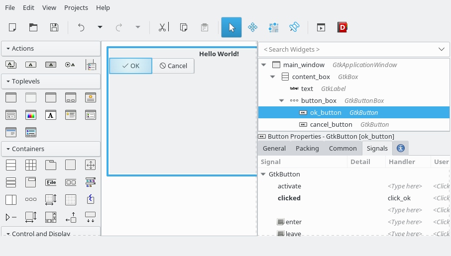

# GtkBuilderAid.jl
[](https://travis-ci.org/Matt5sean3/GtkBuilderAid.jl)
[](https://coveralls.io/github/Matt5sean3/GtkBuilderAid.jl?branch=master)

This package's functionality is very narrowly to add support for the signal
connection features of [Glade](https://glade.gnome.org/) and GtkBuilder objects
in [Julia](http://julialang.org/).

This package builds on top of the
[Julia interface to Gtk](https://github.com/JuliaLang/Gtk.jl).

## Installation

This package can be installed by use of Julia's in-built package manager as the
`GtkBuilderAid` package. As a result `Pkg.add` is usually sufficient to install
this package:

```julia
Pkg.add("GtkBuilderAid")
```

## Example

A simple example that matches up with the shown GUI is displayed below.

### Julia Code

```julia
function_table = @GtkFunctionTable begin

@guarded function click_ok(
    widget, 
    user_info)
  println("OK clicked!")
  return nothing
end

@guarded function close_window(
    widget,
    window)
  destroy(window)
  return nothing
end

end

quickstart(function_table, "com.github.matt5sean", "main_window", "resources/main.ui", nothing)

```

All of the functions defined in the block starting with
`function_table = @GtkFunctionTable` are compiled into a Dict mapping the
function names to the functions themselves. This dictionary can then be
used with various methods to make them accessible as handlers for the builder
object.

### Glade Design

Note how the handler for `click_ok` is filled out directly as `click_ok` to
match the code above.



## User Data Choices

The arguments to the macro preceding the filename and code block generally
refine how the macro should behave. The most important of these directives are
the user data directives of which there are four. However, user data may also be
set within glade using the `User data` field in the `Signals` tab of the widget
properties.

### Glade User data

In cases where the user data is set in glade, the user data type will be
converted to the proper `GObject` type. In the code block above this is
demonstrated with the `close_window` function which will receive a `GtkWindow`
type as its user data argument.

### Julia Bound User Data

User data may also be bound by modifying the function table.

```julia
example_app = GtkApplication("com.github.example", 0)

builder = @GtkFunctionTable begin

@guarded function click_ok(
    widget,
    user_info)
  println("OK clicked!")
  return nothing::Void
end

@guarded function close_window(
    widget,
    window)
  destroy(window)
  return nothing::Void
end

end

@guarded function activateApp(widget, userdata)
  app, builder = userdata
  built = GtkBuilder(filename="$(Pkg.dir("*your_package*"))/resources/main.ui")
  builder(built, (app, ))
  win = Gtk.GAccessor.object(built, "main_window")
  push!(app, win)
  showall(win)
  return nothing
end

signal_connect(activateApp, example_app, :activate, Void, (), false, (example_app, builder))

run(example_app)
```

## Additional Considerations

### Examples

There are [examples available for examination](examples/README.md) in this
package in the examples directory.

### Helper Functions

There are a few helper functions added to this package to make certain
functionalities easier.

#### `quit`

This helper function adds a method to Julia's base `quit` function that takes a
`GtkApplication` object as its first argument and call the C function
`g_application_quit` on it. This is a very useful function for explicitly
stopping a running application.

#### `reveal_area`

This is similar to calling Gtk.jl's `reveal` function but rather than causing
the entire widget to be updated only a particular piece of the widget is
revealed by this function. The first argument is a GtkWidget while the
subsequent arguments are the x coordinate, y coordinate, width, and height of
the top-left corner of the rectangular area to update. As an example,
`reveal_area(w, 5, 10, 50, 60)` would update a 50 pixel by 60 pixel rectangle at
5 pixels from the left side of the widget and 10 pixels from the top of the
widget.

#### `create_similar_surface`

This helper function creates a `CairoSurface` based on a realized widget with
dimensions matching the widget. The first argument must be the widget for which
the surface is created. A second optional argument, which is
`Cairo.CONTENT_COLOR_ALPHA` by default, allows choosing the content type of the
Cairo surface.

### Macros

Some macros at the first layer of the block processed by the `@GtkFunctionTable`
macro are manually expanded during analysis of that block. The expansion will be
kept and added to the list of signals in the case that the expanded expression
is a function definition. Macros that don't result in function definitions will
be left to expand as they would have otherwise. This expansion works well enough
for simple macros such as the Gtk wrapper library's `@guarded` macro but has the
potential to cause complications in more complex macros.

### Nested Blocks

Only functions defined at the level of the block within the macro will be
converted to C functions and be enabled as signals. This is partly to give a
means to define functions that won't be used as functions.

### Function Calls

Calling other functions that are defined within the signal handler block will
result in an error in effectively every case. Any functionality that needs to be
reused in multiple signals should instead be defined outside of the signal
handler block. This behaviour will not be changed for future versions.

